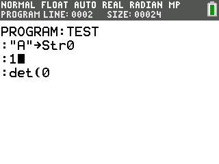

# CelticCE  

CelticCE is a hybrid TI-BASIC library for the TI-84 Plus CE, which allows you to call more powerful assembly commands from your TI-BASIC programs. These commands include many features not possible in plain TI-BASIC.

## Commands

A full list of all commands currently in CelticCE can be found [here](https://github.com/RoccoLoxPrograms/CelticCE/blob/main/COMMANDS.md).

If you'd like a more detailed and complete documentation, you can view the online documentation [here](https://roccoloxprograms.github.io/CelticCE).

## Installation

1. Download the latest release of CelticCE [here](https://github.com/roccoloxprograms/celticce/releases/latest). To avoid confusion, the file that you really need is called `CelticCE.8xp`.
2. Transfer the CelticCE installer that you just downloaded to your calculator using a linking program of your choice, such as [TI-Connect CE](https://education.ti.com/en/software/details/en/CA9C74CAD02440A69FDC7189D7E1B6C2/swticonnectcesoftware) or [TiLP](http://lpg.ticalc.org/prj_tilp/).
3. Run the **CELTICCE** program on your calculator, which can be found under the <kbd>prgm</kbd> menu. If you are on an OS version 5.5 or greater, you will need to use the [arTIfiCE jailbreak](https://yvantt.github.io/arTIfiCE/).
4. Finish running the installer by selecting whether or not to delete the installer program. It will not be needed unless you for some reason wish to reinstall the CelticCE app, so it is safe to delete.
5. Find **CelticCE** in the <kbd>apps</kbd> menu and open it.
6. Press <kbd>1</kbd> to install CelticCE, then press <kbd>3</kbd> to exit the app.

## Using Celtic

CelticCE commands are called in TI-BASIC programs using the `det(` token followed by varying arguments. You can read more about the specifics in the Celtic docs under [General Syntax](https://roccoloxprograms.github.io/CelticCE/gensyntax.html).

Along with the CelticCE app installer, you'll notice that there is another program, **AINSTALL**, which comes with Celtic. If you choose to send this to your calculator, running it will install Celtic's hooks outside of the app, as long as the app is present on your calculator. This can be useful if you want to install CelticCE during the execution of another program. You can learn more about this in the [General Syntax](https://roccoloxprograms.github.io/CelticCE/gensyntax.html) section of CelticCE's documentation.

CelticCE also has a few useful features which are added to the TI-OS editor when it is installed. The first of these is a command preview, which will display the basic syntax of a command on the status bar if the cursor is hovering over a valid Celtic command as seen below:

If you press <kbd>2nd</kbd> + <kbd>enter</kbd> in the OS editor when Celtic is installed, it will also display the current line number, byte offset, and program size like so:

**IMPORTANT!**

Do not attempt to use Celtic for anything that it was not originally designed to do. Doing such could have unintended consequences that could cause bad things to happen to your calculator. If you choose to abuse Celtic in such a way, you and only you are responsible for anything that comes from it.

## Bug Reports / Feedback

If you encounter an issue or bug with CelticCE or have suggestions for improvements or features to be added, feel free to [make an issue](https://github.com/roccoloxprograms/celticce/issues). You can also get help or suggest things in the [project discord server](https://discord.gg/RDTtu258fW).

Thanks for using CelticCE!
