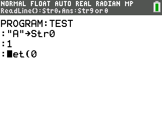

General Syntax
==============

Overview
~~~~~~~~

Celtic uses a parser hook to search for a token in your program and run its ASM code if it finds it.
When it encounters the ``det(`` token, Celtic will detect which function you are calling and any arguments with it.
The first argument after the ``det(`` token tells Celtic which function you wish to call.
If you have entered a valid argument, Celtic will tell you what function the argument is referencing in the status bar of the program editor when your cursor is over it.

    Celtic's function preview feature.

.. note::
    In the event that you pass invalid arguments to Celtic, it will return an error. See the `Error Codes <errorcodes.html>`__ page for more information.

Check if Celtic is Installed
~~~~~~~~~~~~~~~~~~~~~~~~~~~~

If your program uses Celtic, it is recommended that it makes sure Celtic is installed when ran. To check if Celtic is installed, it is recommended you put something like this at the beginning of your program::

    ::DCS
    :"Icon data...
    :If 90>det([[20
    :Then
    :Disp "Get Celtic CE to run this:","bit.ly/CelticCE
    :Return
    :End

``det([[20]])`` will equal 90 if Celtic CE is installed. If the program aims to be compatible with Celtic 2 CSE, you may wish to refer to the `list of version codes <https://dcs.cemetech.net/index.php?title=Third-Party_BASIC_Libraries_(Color)>`__ on the DCS Wiki as well.

Argument Types
~~~~~~~~~~~~~~

Arguments are passed to Celtic in three different ways. They can be passed in the ``det(`` function, in the ``Ans`` variable, or in a string.
The method of passing arguments will differ, depending on the function and the type of argument that is being passed.
The specific syntax for each function is listed in the documentation.

Most often, numerical arguments are passed in the ``det(`` function. Variable names are put in ``Str0``, and strings arguments are put in ``Str9``. The exact usage will vary depending on the function.
Celtic only accepts positive real integers as arguments. If a decimal number is passed, Celtic will only take the integer part of it.

When using ``Str0`` as a program name, simply store the name of the program into ``Str0``. When storing an AppVar, begin the string with the ``rowSwap(`` token. For example::
    
    :"FOO" -> Str0              //program FOO
    :"rowSwap(FOO" -> Str0      //AppVar FOO

If a string is used, it must be in the RAM when the function is called.

Returns
~~~~~~~
Depending on the function, Celtic will return a value after it runs. For example, the ``SpecialChars`` function fills ``Str9`` with certain special characters.

String returns are most often in ``Str9``, while numerical returns are in the theta variable. All functions will return the initial contents of ``Ans`` (in order to preserve it).
