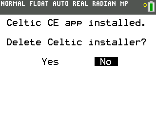
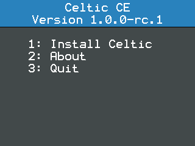

Installation
============
Downloading the Installer
~~~~~~~~~~~~~~~~~~~~~~~~~

* Download the latest release of Celtic CE from the `GitHub releases page <https://github.com/RoccoLoxPrograms/CelticCE/releases/latest>`__.
* Transfer ``CelticCE.8xp`` to your calculator using TI-Connect CE or TiLP.

Installing the App
~~~~~~~~~~~~~~~~~~

* Open the programs menu and select ``CELTICCE``.
* Run ``CELTICCE`` and follow through the installation process.

    The Celtic installer menu.

.. note::
    If you delete the installer, you'll need to send it to the calculator again, should the app ever get deleted.
    However, you can still uninstall and re-install the Celtic CE library using the app. The program is only used for installing the app onto the calculator.

* Open the apps menu and select ``CelticCE``.
* Press [1] to install. You can now exit the app by pressing [3] or [clear].

    The Celtic app.

.. note::
    Depending on the other programs you have installed on your calculator, you may only see an "Uninstall" option.
    To install Celtic CE, you'll need to first press [1] to uninstall the exisiting program, and then press [1] again to install Celtic CE.
    Note that this will override any pre-exisitng libraries/hooks conflicting with Celtic CE.
